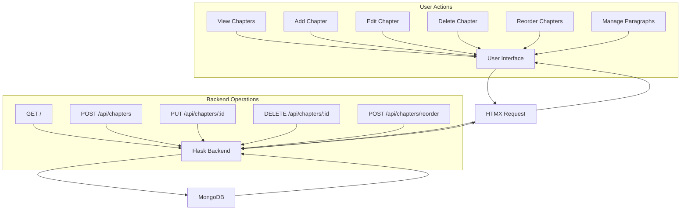
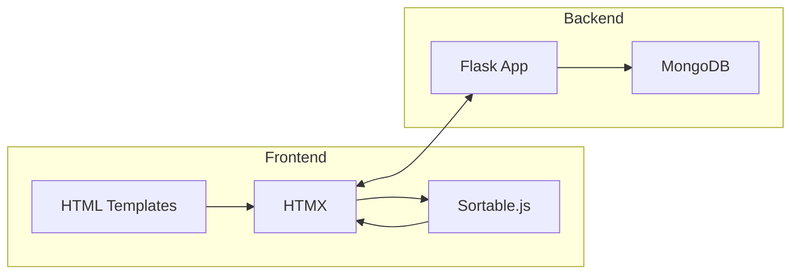

# SmartScope

A modern web application for managing chapters and paragraphs with a beautiful, responsive interface. Built with Flask, HTMX, and MongoDB.

## Features

- 📝 Create and manage chapters
- 📋 Drag-and-drop chapter reordering
- ✏️ Edit chapter titles inline
- 🗑️ Delete chapters
- 📄 Add and manage paragraphs within chapters
- 🎨 Modern, responsive UI with Tailwind CSS
- ⚡ Real-time updates with HTMX
- 🐳 Docker support for easy deployment

## Tech Stack

- **Backend**: Flask (Python)
- **Database**: MongoDB
- **Frontend**: HTMX + Tailwind CSS
- **JavaScript**: Sortable.js for drag-and-drop
- **Containerization**: Docker & Docker Compose

## Application Flow



## Architecture



## Getting Started

### Prerequisites

- Docker and Docker Compose
- Git

### Installation

1. Clone the repository:
   ```bash
   git clone https://github.com/yourusername/smartscope.git
   cd smartscope
   ```

2. Start the application:
   ```bash
   docker-compose up --build
   ```

3. Access the application:
   Open your browser and navigate to `http://localhost:8000`

### Development

The application uses hot-reloading, so any changes you make to the code will be reflected immediately in the browser.

## Project Structure

```
smartscope/
├── app.py              # Flask application
├── docker-compose.yml  # Docker Compose configuration
├── Dockerfile         # Docker configuration
├── requirements.txt   # Python dependencies
├── static/           # Static files (JS, CSS)
├── templates/        # HTML templates
└── logs/            # Application logs
```

## API Endpoints

| Method | Endpoint | Description |
|--------|----------|-------------|
| GET | `/` | Display main page |
| GET | `/chapter/<id>` | Get chapter details |
| POST | `/api/chapters` | Create new chapter |
| PUT | `/api/chapters/<id>` | Update chapter |
| DELETE | `/api/chapters/<id>` | Delete chapter |
| POST | `/api/chapters/reorder` | Reorder chapters |
| POST | `/api/chapters/<id>/paragraphs` | Add paragraph |
| PUT | `/api/chapters/<id>/paragraphs/<index>` | Update paragraph |
| DELETE | `/api/chapters/<id>/paragraphs/<index>` | Delete paragraph |

## Contributing

1. Fork the repository
2. Create your feature branch (`git checkout -b feature/AmazingFeature`)
3. Commit your changes (`git commit -m 'Add some AmazingFeature'`)
4. Push to the branch (`git push origin feature/AmazingFeature`)
5. Open a Pull Request

## License

This project is licensed under the MIT License - see the LICENSE file for details.

## Acknowledgments

- [HTMX](https://htmx.org/) for making dynamic web applications simple
- [Sortable.js](https://github.com/SortableJS/Sortable) for drag-and-drop functionality
- [Tailwind CSS](https://tailwindcss.com/) for the beautiful UI
- [Flask](https://flask.palletsprojects.com/) for the Python web framework 