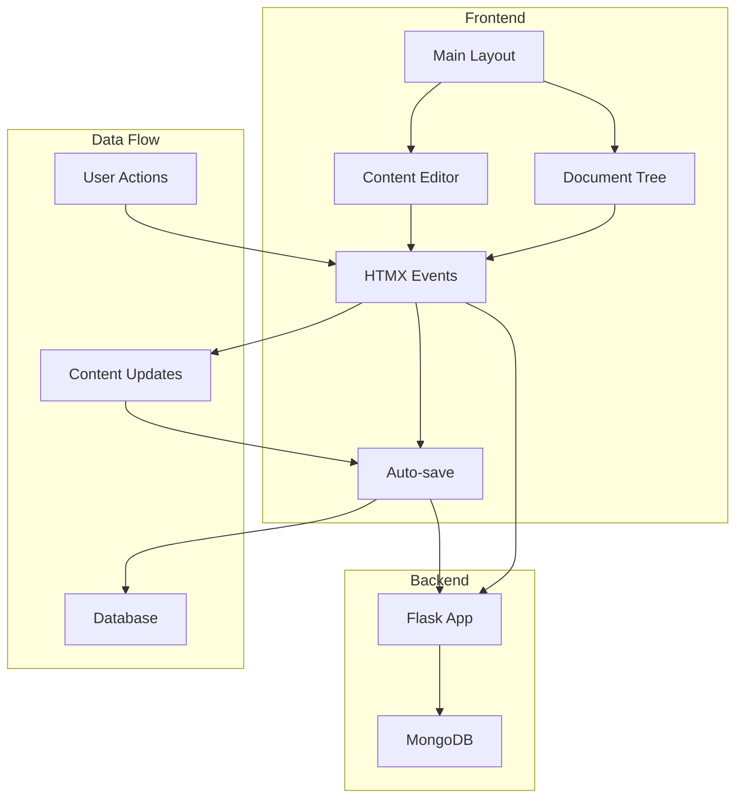
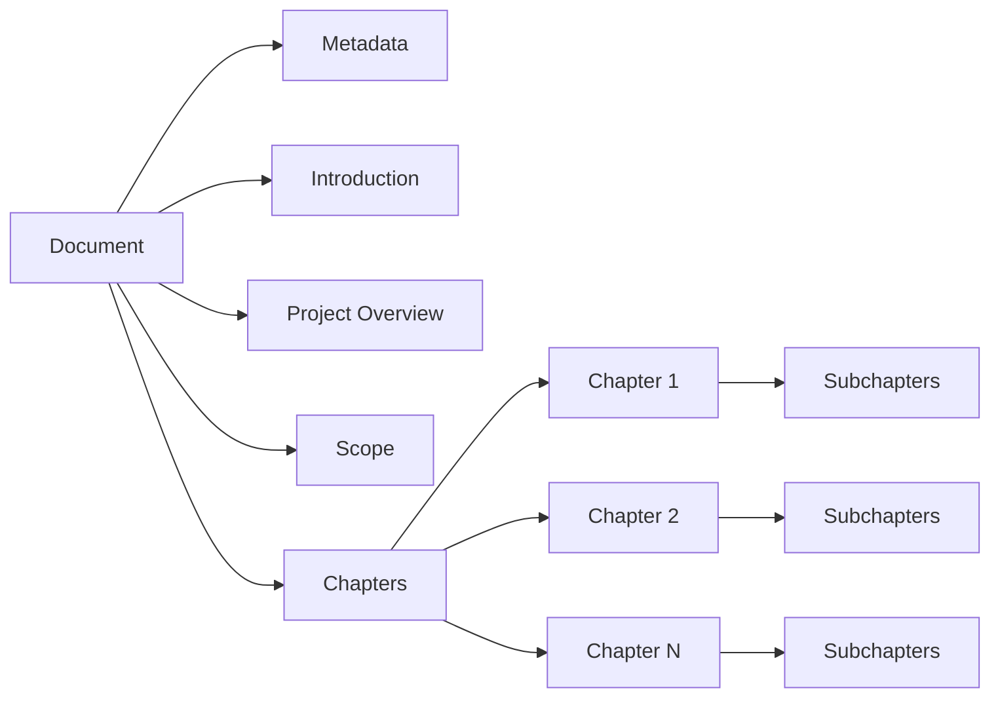
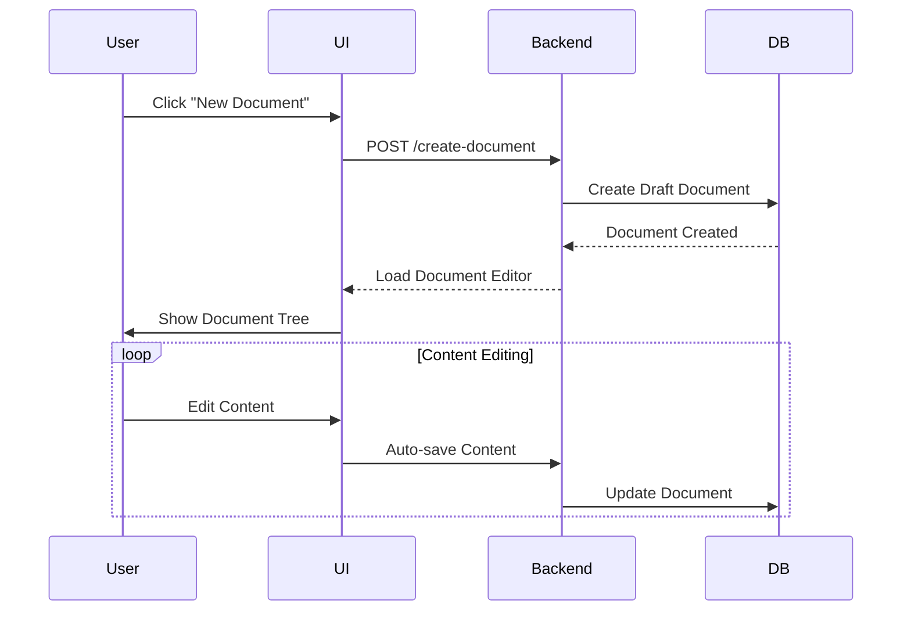
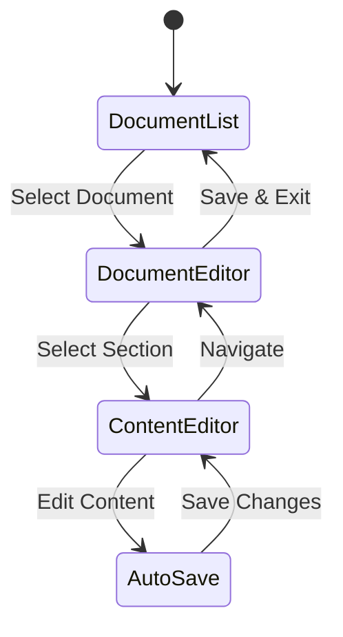
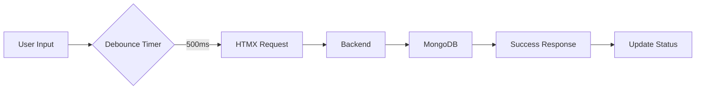
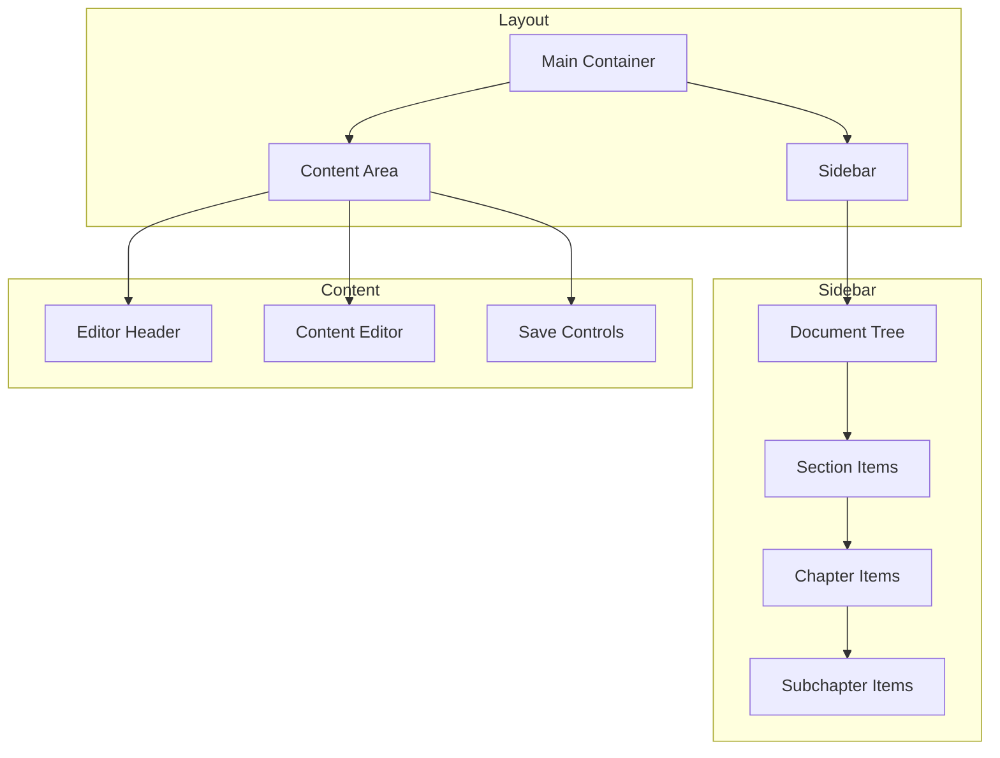

# SmartScope Documentation Management System

A modern documentation management system built with Flask, HTMX, and MongoDB, featuring a dark theme and responsive design.

## Features

- **Document Management**
  - Create, edit, and organize documents
  - Hierarchical document structure with chapters and subchapters
  - Auto-save functionality
  - Draft management system

- **User Interface**
  - Dark theme with Bootstrap 5
  - Responsive design
  - Interactive document tree
  - Real-time content editing
  - HTMX-powered dynamic updates

- **Document Structure**
  - Introduction
  - Project Overview
  - Scope
  - Chapters and Subchapters
  - Dynamic content management

## Architecture

### Component Architecture



### Document Structure Flow



## Workflows

### Document Creation Flow



### Content Management Flow



### Auto-save Mechanism



### Document Tree Navigation

```mermaid
graph TD
    A[Document Tree] --> B[Introduction]
    A --> C[Project Overview]
    A --> D[Scope]
    A --> E[Chapters]
    
    E --> F[Chapter 1]
    E --> G[Chapter 2]
    
    F --> H[Subchapter 1.1]
    F --> I[Subchapter 1.2]
    
    G --> J[Subchapter 2.1]
    G --> K[Subchapter 2.2]
    
    style A fill:#2d3748,stroke:#4a5568
    style B fill:#2d3748,stroke:#4a5568
    style C fill:#2d3748,stroke:#4a5568
    style D fill:#2d3748,stroke:#4a5568
    style E fill:#2d3748,stroke:#4a5568
    style F fill:#2d3748,stroke:#4a5568
    style G fill:#2d3748,stroke:#4a5568
    style H fill:#2d3748,stroke:#4a5568
    style I fill:#2d3748,stroke:#4a5568
    style J fill:#2d3748,stroke:#4a5568
    style K fill:#2d3748,stroke:#4a5568
```



### Frontend Components



### Backend Services


## Architecture

### Frontend
- **Templates**
  - `index.html`: Main application layout
  - `create_edit_document.html`: Document creation and editing interface
  - `docs_list.html`: Document listing and management
  - `settings.html`: Application settings

- **Static Assets**
  - `styles.css`: Main application styles
  - `styles_wizard.css`: Document creation wizard styles
  - Custom icons and components

### Backend
- **Routes**
  - Document Management:
    - `/docs`: List all documents
    - `/create-document`: Create new document
    - `/edit-doc/<doc_id>`: Edit existing document
    - `/delete-doc/<doc_id>`: Delete document
  - Content Management:
    - `/load-content/<section_id>`: Load document section content
    - `/load-content/chapter/<chapter_number>`: Load chapter content
    - `/save-content/<section_id>`: Save section content
    - `/auto-save-content/<section_id>`: Auto-save content changes
  - Auto-save:
    - `/auto-save`: Handle document auto-save

- **Database**
  - MongoDB document structure:
    ```json
    {
      "_id": ObjectId,
      "title": String,
      "product": String,
      "version": String,
      "status": String,
      "introduction": String,
      "project_overview": String,
      "scope": String,
      "chapters": [
        {
          "number": Integer,
          "title": String,
          "content": String,
          "subchapters": [
            {
              "number": Integer,
              "title": String,
              "content": String
            }
          ]
        }
      ],
      "created_at": DateTime,
      "updated_at": DateTime
    }
    ```

## Workflows

### Document Creation
1. User clicks "New Document"
2. System creates a draft document in MongoDB
3. User fills in document metadata (title, product, version)
4. User navigates through document sections using sidebar
5. Content is auto-saved as user types
6. User can manually save changes
7. Document status can be set to draft, review, or published

### Content Editing
1. User clicks a section in the document tree
2. Content editor loads in the main panel
3. Changes are auto-saved after 500ms of inactivity
4. User can manually save changes
5. Content is preserved between section navigation

### Document Management
1. Documents are listed with their metadata
2. Users can edit, delete, or view documents
3. Document status is clearly indicated
4. Changes are tracked with timestamps

## Setup and Installation

1. Clone the repository
2. Install dependencies:
   ```bash
   pip install -r requirements.txt
   ```
3. Configure MongoDB connection in `app.py`
4. Run the application:
   ```bash
   python app.py
   ```

## Development

### Adding New Features
1. Create new routes in `app.py`
2. Add corresponding templates
3. Update static assets as needed
4. Test with HTMX interactions

### Styling Guidelines
- Use Bootstrap 5 classes
- Follow dark theme color scheme
- Maintain responsive design
- Use HTMX for dynamic updates

## Contributing

1. Fork the repository
2. Create a feature branch
3. Commit your changes
4. Push to the branch
5. Create a Pull Request

## License

This project is licensed under the MIT License - see the LICENSE file for details.

## Acknowledgments

- [HTMX](https://htmx.org/) for making dynamic web applications simple
- [Sortable.js](https://github.com/SortableJS/Sortable) for drag-and-drop functionality
- [Tailwind CSS](https://tailwindcss.com/) for the beautiful UI
- [Flask](https://flask.palletsprojects.com/) for the Python web framework 