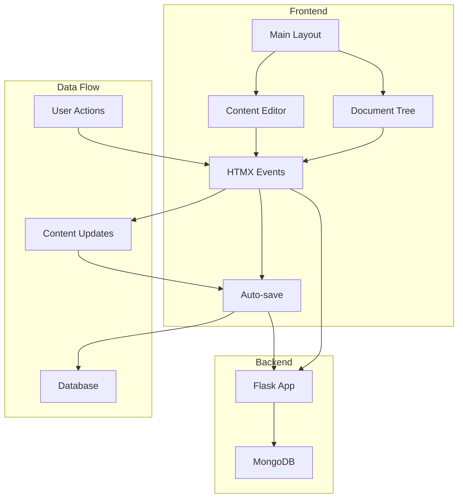
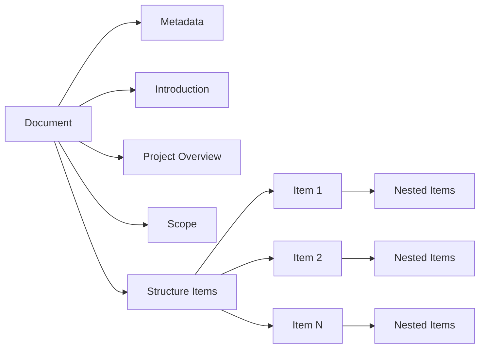
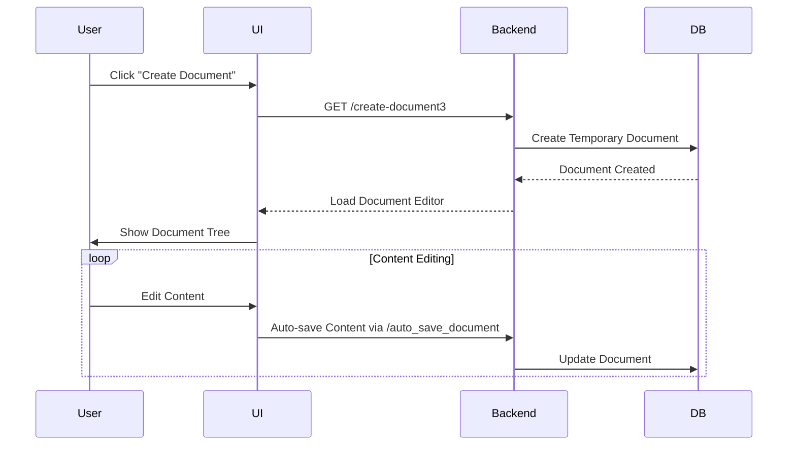
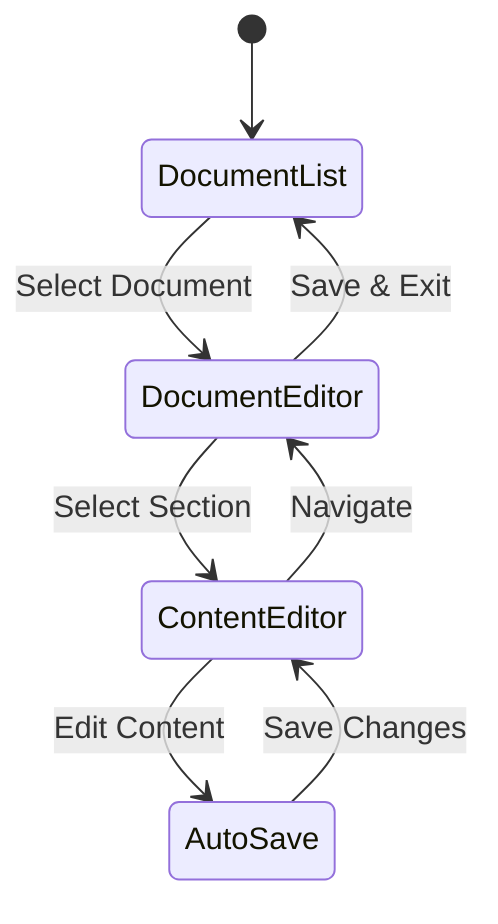
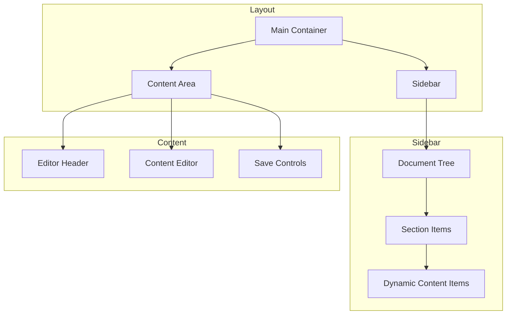
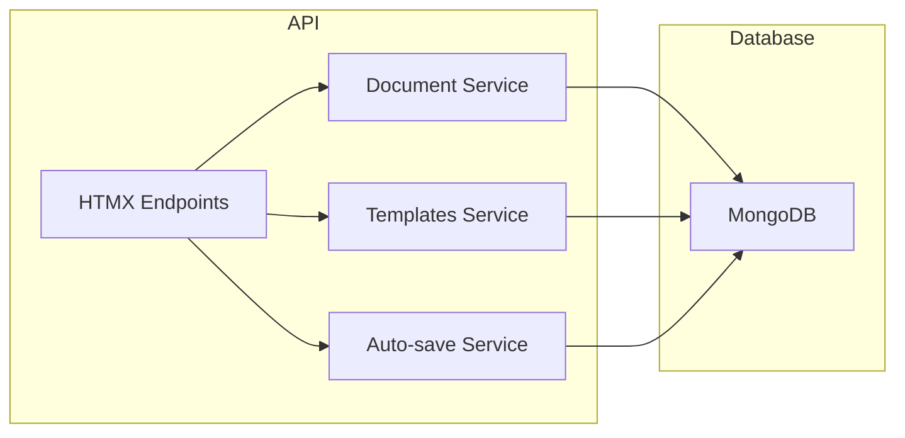

# SmartScope Documentation Management System

A modern documentation management system built with Flask, HTMX, and MongoDB, featuring a dark theme and responsive design.

## Features

- **Document Management**
  - Create, edit, and organize documents
  - Hierarchical document structure with chapters and subchapters
  - Auto-save functionality
  - Draft management system

- **User Interface**
  - Dark theme with Bootstrap 5
  - Responsive design
  - Interactive document tree
  - Real-time content editing
  - HTMX-powered dynamic updates

- **Document Structure**
  - Introduction
  - Project Overview
  - Scope
  - Chapters and Subchapters
  - Dynamic content management

## Architecture

### Component Architecture



### Document Structure Flow



## Workflows

### Document Creation Flow



### Content Management Flow



### Auto-save Mechanism

```mermaid
graph LR
    A[User Input] --> B{Debounce Timer}
    B -->|500ms| C[Fetch Request]
    C --> D[/auto_save_document]
    D --> E[MongoDB temp_documents]
    E --> F[Success Response]
    F --> G[Update Status]
```

### Document Tree Navigation

```mermaid
graph TD
    A[Document Tree] --> B[Introduction]
    A --> C[Project Overview]
    A --> D[Scope]
    A --> E[Dynamic Items]
    
    E --> F[Item 1]
    E --> G[Item 2]
    
    F --> H[Nested Item 1.1]
    F --> I[Nested Item 1.2]
    
    G --> J[Nested Item 2.1]
    G --> K[Nested Item 2.2]
    
    style A fill:#2d3748,stroke:#4a5568
    style B fill:#2d3748,stroke:#4a5568
    style C fill:#2d3748,stroke:#4a5568
    style D fill:#2d3748,stroke:#4a5568
    style E fill:#2d3748,stroke:#4a5568
    style F fill:#2d3748,stroke:#4a5568
    style G fill:#2d3748,stroke:#4a5568
    style H fill:#2d3748,stroke:#4a5568
    style I fill:#2d3748,stroke:#4a5568
    style J fill:#2d3748,stroke:#4a5568
    style K fill:#2d3748,stroke:#4a5568
```



### Frontend Components



### Backend Services



## Architecture

### Frontend
- **Templates**
  - `index.html`: Main application layout with sidebar and content area
  - `create_edit_doc.html`: Document creation and editing interface
  - `docs_list.html`: Document listing and management
  - `templates.html`: Template listing
  - `template_form.html`: Template creation form
  - `dashboard.html`: Dashboard view
  - `settings.html`: Application settings
  - `users.html`: User management
  - `partials/document_item.html`: Document item partial
  - `partials/document_editor.html`: Document editor partial

- **Static Assets**
  - `styles_wizard.css`: Main application styles
  - `js/sidebar.js`: Sidebar functionality

### Backend
- **Routes**
  - Main Pages:
    - `/`: Main entry point, renders index.html
    - `/dashboard`: Dashboard page
    - `/settings`: Settings page
    - `/users`: Users management page
  - Document Management:
    - `/docs`: List all documents
    - `/create-document3`: Create new document with dynamic structure
    - `/delete-doc/<doc_id>`: Delete document
  - Content Management:
    - `/get_document/<item_id>`: Get specific document item content
    - `/add_document_item`: Add new item to document structure
    - `/auto_save_document`: Handle document auto-save
  - Template Management:
    - `/templates`: List all templates
    - `/templates-list`: Render template list partial
    - `/template-form`: Template creation form
    - `/create-template`: Create new template
    - `/delete-template/<template_id>`: Delete template
    - `/edit-template/<template_id>`: Edit template

- **Database**
  - MongoDB Collections:
    - `documents`: Permanent documents
    - `temp_documents`: Temporary documents for editing
    - `templates`: Document templates

  - Document structure:
    ```json
    {
      "_id": ObjectId,
      "title": String,
      "structure": [
        {
          "id": String,
          "title": String,
          "content": String,
          "children": [
            {
              "id": String,
              "title": String,
              "content": String,
              "children": []
            }
          ]
        }
      ],
      "created_at": DateTime,
      "updated_at": DateTime
    }
    ```

  - Template structure:
    ```json
    {
      "_id": ObjectId,
      "title": String,
      "product": String,
      "version": String,
      "status": String,
      "introduction": String,
      "project_overview": String,
      "scope": String
    }
    ```

## Workflows

### Document Creation
1. User clicks "New Document"
2. System creates a draft document in MongoDB
3. User fills in document metadata (title, product, version)
4. User navigates through document sections using sidebar
5. Content is auto-saved as user types
6. User can manually save changes
7. Document status can be set to draft, review, or published

### Content Editing
1. User clicks a section in the document tree
2. Content editor loads in the main panel
3. Changes are auto-saved after 500ms of inactivity
4. User can manually save changes
5. Content is preserved between section navigation

### Document Management
1. Documents are listed with their metadata
2. Users can edit, delete, or view documents
3. Document status is clearly indicated
4. Changes are tracked with timestamps

## Setup and Installation

1. Clone the repository
2. Install dependencies:
   ```bash
   pip install -r requirements.txt
   ```
3. Configure MongoDB connection in `app.py`
4. Run the application:
   ```bash
   python app.py
   ```

## Development

### Adding New Features
1. Create new routes in `app.py`
2. Add corresponding templates
3. Update static assets as needed
4. Test with HTMX interactions

### Styling Guidelines
- Use Bootstrap 5 classes
- Follow dark theme color scheme
- Maintain responsive design
- Use HTMX for dynamic updates

## Contributing

1. Fork the repository
2. Create a feature branch
3. Commit your changes
4. Push to the branch
5. Create a Pull Request

## License

This project is licensed under the MIT License - see the LICENSE file for details.

## Acknowledgments

- [HTMX](https://htmx.org/) for making dynamic web applications simple
- [Sortable.js](https://github.com/SortableJS/Sortable) for drag-and-drop functionality
- [Tailwind CSS](https://tailwindcss.com/) for the beautiful UI
- [Flask](https://flask.palletsprojects.com/) for the Python web framework

## Environment Setup

### Prerequisites
- Python 3.8+
- MongoDB 4.4+
- Node.js 14+ (for development tools)
- Git

### Development Environment
1. Clone the repository:
   ```bash
   git clone https://github.com/yourusername/smartscope.git
   cd smartscope
   ```

2. Create and activate virtual environment:
   ```bash
   python -m venv venv
   source venv/bin/activate  # On Windows: venv\Scripts\activate
   ```

3. Install dependencies:
   ```bash
   pip install -r requirements.txt
   ```

4. Set up environment variables:
   ```bash
   cp .env.example .env
   # Edit .env with your configuration
   ```

### Configuration

#### Environment Variables
```bash
# MongoDB Configuration
MONGODB_URI=mongodb://localhost:27017
MONGODB_DB=smartscope

# Flask Configuration
FLASK_APP=app.py
FLASK_ENV=development
SECRET_KEY=your-secret-key

# Application Settings
DEBUG=True
PORT=5000
```

#### MongoDB Setup
1. Install MongoDB Community Edition
2. Start MongoDB service
3. Create database and collections:
   ```javascript
   use smartscope
   db.createCollection('documents')
   db.createCollection('users')
   ```

## API Documentation

### Document Management Endpoints

#### Create Document
```http
POST /create-document
Content-Type: application/json

{
    "title": "Document Title",
    "product": "Product Name",
    "version": "1.0.0"
}
```

#### Update Content
```http
POST /save-content/<section_id>
Content-Type: application/json

{
    "content": "Updated content",
    "section_id": "introduction"
}
```

#### Auto-save Content
```http
POST /auto-save-content/<section_id>
Content-Type: application/json

{
    "content": "Auto-saved content",
    "section_id": "chapter_1"
}
```

### HTMX Endpoints

#### Add Chapter
```http
GET /add-chapter
```

#### Add Subchapter
```http
GET /add-subchapter/<chapter_index>
```

#### Remove Chapter
```http
DELETE /remove-chapter/<chapter_index>
```

#### Remove Subchapter
```http
DELETE /remove-subchapter/<chapter_index>/<subchapter_index>
```

## Development Guidelines

### Code Style
- Follow PEP 8 for Python code
- Use ESLint for JavaScript
- Maintain consistent indentation (4 spaces)
- Use meaningful variable and function names

### Git Workflow
1. Create feature branch:
   ```bash
   git checkout -b feature/your-feature-name
   ```

2. Commit changes:
   ```bash
   git add .
   git commit -m "feat: add new feature"
   ```

3. Push changes:
   ```bash
   git push origin feature/your-feature-name
   ```

### Testing
1. Run unit tests:
   ```bash
   python -m pytest tests/
   ```

2. Run coverage:
   ```bash
   coverage run -m pytest
   coverage report
   ```

## Troubleshooting

### Common Issues

#### MongoDB Connection Issues
- Verify MongoDB service is running
- Check connection string in .env
- Ensure correct port (default: 27017)

#### HTMX Requests Failing
- Check browser console for errors
- Verify endpoint URLs
- Ensure proper response format

#### Auto-save Not Working
- Check network tab for failed requests
- Verify debounce timer settings
- Check MongoDB connection

### Debugging
1. Enable Flask debug mode:
   ```bash
   export FLASK_DEBUG=1
   ```

2. Check logs:
   ```bash
   tail -f logs/app.log
   ```

3. Use browser developer tools:
   - Network tab for API requests
   - Console for JavaScript errors
   - Elements for DOM inspection

## Deployment

### Production Setup
1. Configure production environment:
   ```bash
   export FLASK_ENV=production
   export DEBUG=False
   ```

2. Set up Gunicorn:
   ```bash
   gunicorn -w 4 -b 0.0.0.0:5000 app:app
   ```

3. Configure Nginx:
   ```nginx
   server {
       listen 80;
       server_name yourdomain.com;

       location / {
           proxy_pass http://localhost:5000;
           proxy_set_header Host $host;
           proxy_set_header X-Real-IP $remote_addr;
       }
   }
   ```

### Docker Deployment
1. Build image:
   ```bash
   docker build -t smartscope .
   ```

2. Run container:
   ```bash
   docker run -d -p 5000:5000 --env-file .env smartscope
   ```

## Security

### Best Practices
- Use environment variables for sensitive data
- Implement proper authentication
- Sanitize user input
- Use HTTPS in production
- Regular security updates

### Data Protection
- Encrypt sensitive data
- Regular backups
- Access control
- Audit logging

## Performance Optimization

### Frontend
- Minify CSS and JavaScript
- Optimize images
- Use CDN for static assets
- Implement caching

### Backend
- Database indexing
- Query optimization
- Caching strategies
- Connection pooling

## Support

### Getting Help
- Check documentation
- Search existing issues
- Create new issue
- Contact maintainers

### Contributing
1. Fork the repository
2. Create feature branch
3. Submit pull request
4. Follow code review process

## Roadmap

### Planned Features
- [ ] Rich text editor integration
- [ ] Version control system
- [ ] Collaborative editing
- [ ] Export to multiple formats
- [ ] Advanced search functionality
- [ ] User roles and permissions

### Future Improvements
- Performance optimizations
- Enhanced security features
- Mobile app development
- API documentation
- Automated testing

## Changelog

### [1.0.0] - 2024-03-20
- Initial release
- Basic document management
- Auto-save functionality
- Dark theme UI

## License

This project is licensed under the MIT License - see the [LICENSE](LICENSE) file for details.

## Acknowledgments

- [HTMX](https://htmx.org/) for making dynamic web applications simple
- [Sortable.js](https://github.com/SortableJS/Sortable) for drag-and-drop functionality
- [Tailwind CSS](https://tailwindcss.com/) for the beautiful UI
- [Flask](https://flask.palletsprojects.com/) for the Python web framework 